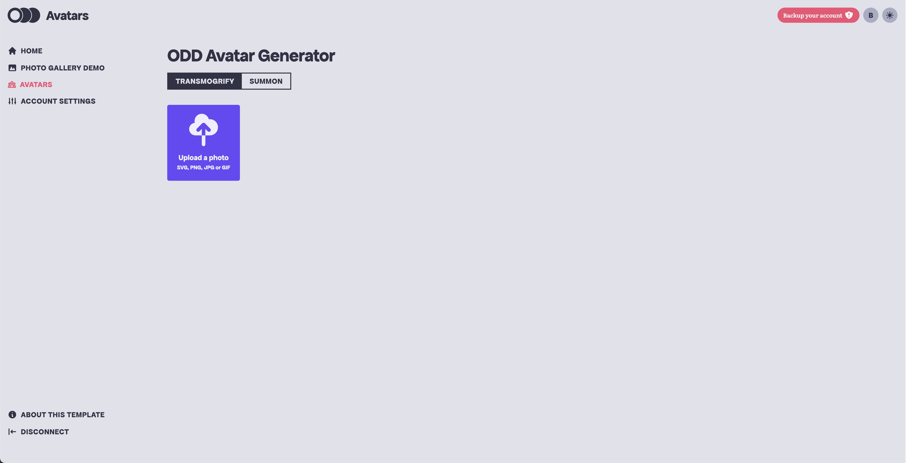
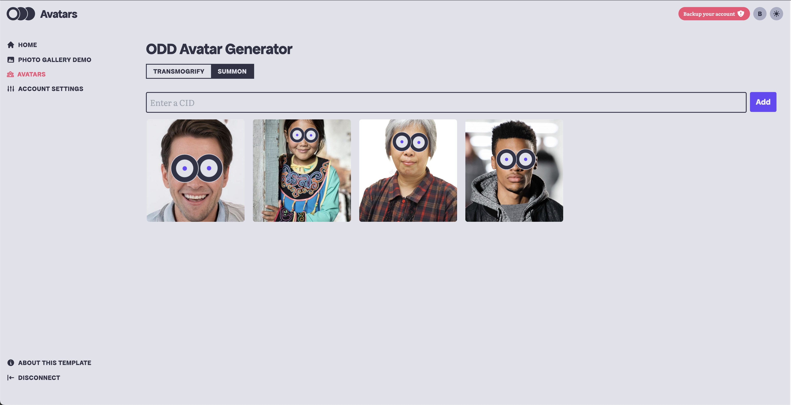
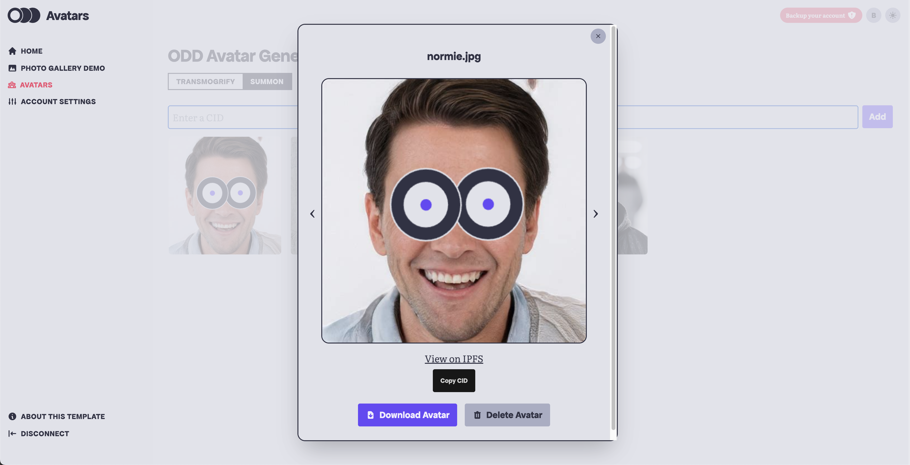

# Fission Dwebcamp Workshop 2023

[](https://fission.codes) [](https://github.com/oddsdk/ts-odd) [](https://discord.gg/zAQBDEq) [](https://talk.fission.codes)

Welcome to the workshop! 👋

We'll be hacking on an app that transmogrifies avatars sending them to a new, odd dimension where you can summon them anywhere across the DWeb.

The completed workshop will include transmogrify and summon views:





## Preparation

Please ensure you have installed `node` and `git` on your machine:

- Install git: https://git-scm.com/book/en/v2/Getting-Started-Installing-Git
- Install node: https://nodejs.org/en/download

If you already have `node` installed, check that you have `v18.0.0` or newer.

You'll also want to install a code editor on your machine. We recommend [VSCode](https://code.visualstudio.com/download), but any code editor will be fine.

## Running the app

Clone the workshop repository:

```sh
git clone https://github.com/oddsdk/dwebcamp-workshop-2023
```

The workshop code will be cloned into the directory where you run this command. It might be convenient to run this command from your Desktop to have the project readily available.

Install the project dependencies:

```sh
cd dwebcamp-workshop-2023
npm install
```

Run the app:

```sh
npm run dev
```

Open Chrome or Firefox, navigate to [localhost:5173](http://localhost:5173), and you should see the app running. Ask for help if you don't!

## Workshop activities

Now that the app is running, we can start writing some code. 🙌

The starter code implements transmogrification and an avatar gallery. Using the ODD SDK, we'll save avatars to the Webnative File System (WNFS). We'll also view our saved avatars on IPFS and explore content identifiers (CIDs).

All of the activities are in two files:

- Transmogrify component: `src/routes/avatars/components/Transmogrify.svelte`
- Summon component: `src/routes/avatars/components/Summon.svelte`

These files are [Svelte](https://svelte.dev/) components, but you will only need to write JavaScript to complete the activities. Each time you save a file, the web app should update without running another command.

Connect as a new user in the app and navigate to the `Avatars` page from the sidebar.

Open the Transmogrify and Summon components in your code editor. Start with the Transmogrify component, then move on to the Summon component.

Each file has activities marked with `TODO` and comments describing the activity. A few additional activities are marked `OPTIONAL ADVANCED ACTIVITY`. Save these for last, and don't worry if you don't complete them! They are advanced for a reason.